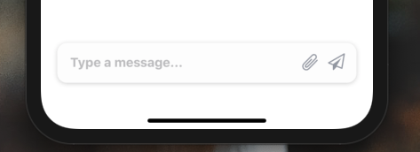
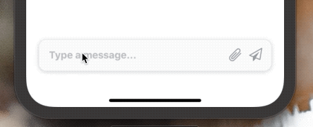

[](https://github.com/Paraboly/@paraboly/react-native-input-bar)

[](https://github.com/Paraboly/@paraboly/react-native-input-bar)

[](https://www.npmjs.com/package/@paraboly/react-native-input-bar)
[](https://www.npmjs.com/package/@paraboly/react-native-input-bar)

[](https://opensource.org/licenses/MIT)
[](https://github.com/prettier/prettier)

<p align="center">


</p>

# Installation

Add the dependency:

```ruby
npm i @paraboly/react-native-input-bar
```

## Peer Dependencies

###### IMPORTANT! You need install them

```js
"react": ">= 16.x.x",
"react-native": ">= 0.55.x",
"react-native-spinkit": ">= 1.5.0",
"react-native-androw": ">= 0.0.34",
"react-native-vector-icons": ">= 6.6.0",
"react-native-dynamic-vector-icons": ">= 0.2.1"
```

### Note: Do not forget to `pod install` for installing properly SpinKit

# Usage

### InputBar should stay at the bottom therefore, please do not forget to set `flex: 1` on your main container. Example is available for the real usage.

## Import

```js
import InputBar from "@paraboly/react-native-input-bar";
```

## Usage

```jsx
<InputBar />
```

## Auto-Grow InputBar Usage

All you need to do is set the `multiline` and set the `height` prop as `null`.

```jsx
<InputBar multiline height={null} minHeight={50} />
```

# Configuration - Props

| Property             |     Type      |       Default       | Description                                                                                                  |
| -------------------- | :-----------: | :-----------------: | ------------------------------------------------------------------------------------------------------------ |
| width                | string/number | 90% of screen width | change the InputBar's width                                                                                  |
| height               | string/number |         50          | change the InputBar's height                                                                                 |
| bottom               | string/number |         24          | change the InputBar's bottom position                                                                        |
| value                |    string     |      undefined      | set the TextInput's value                                                                                    |
| onChangeText         |   function    |      undefined      | handle onChangeText function                                                                                 |
| backgroundColor      |     color     |       #fdfdfd       | set your own color for InputBar's background color                                                           |
| textColor            |     color     |       #9da1ab       | set your own color for TextInput's text color                                                                |
| shadowColor          |     color     |       #757575       | set your own color for TextInput's shadow color                                                              |
| placeholder          |    string     |  Type a message...  | change the TextInput's placeholder                                                                           |
| textInputStyle       |     style     |       default       | set your own style for TextInput                                                                             |
| disablePrimaryIcon   |    boolean    |        false        | disable the primary icon                                                                                     |
| disableSecondaryIcon |    boolean    |        false        | disable the secondary icon                                                                                   |
| primaryIconName      |    string     |        send         | change the primary icon's name                                                                               |
| primaryIconType      |    string     |     FontAwesome     | change the primary icon's type                                                                               |
| primaryIconColor     |    string     |       #9da1ab       | change the primary icon's color                                                                              |
| primaryIconSize      |    number     |         21          | change the primary icon's size                                                                               |
| primaryIconOnPress   |   function    |      undefined      | set a function when primary icon is on pressed                                                               |
| secondaryIconName    |    string     |     attachment      | change the secondary icon's name                                                                             |
| secondaryIconType    |    string     |       Entypo        | change the secondary icon's type                                                                             |
| secondaryIconColor   |    string     |       #9da1ab       | change the secondary icon's color                                                                            |
| secondaryIconSize    |    number     |         21          | change the secondary icon's size                                                                             |
| secondaryIconOnPress |   function    |      undefined      | set a function when secondary icon is on pressed                                                             |
| spinnerVisibility    |    boolean    |        false        | make the spinner visible instead of primarty icon                                                            |
| spinnerType          |    string     |   FadingCircleAlt   | change the spinner type                                                                                      |
| spinnerSize          |    number     |         20          | change the spinner number                                                                                    |
| spinnerColor         |     color     |       #9da1ab       | change the spinner color                                                                                     |
| spinnerStyle         |     style     |      undefined      | set your own style for spinner                                                                               |
| multiline            |    boolean    |        false        | if you want **auto-grow** text `InputBar` then you need to use this prop & set the `height` prop to `null` ! |
| minHeight            | string/number |         50          | change the minimum height of the `InputBar`                                                                  |
| maxHeight            | string/number |        null         | change the maximum height of the `InputBar`                                                                  |

# Change Log

## [0.1.0](https://github.com/Paraboly/react-native-input-bar/releases/tag/0.1.0) (2020-02-25)

Auto-grow feature is here 🥳

## [0.0.5](https://github.com/Paraboly/react-native-input-bar/tree/0.0.5) (2019-12-19)

[Full Changelog](https://github.com/Paraboly/react-native-input-bar/compare/0.0.4...0.0.5)
⚠ BREAKING CHANGE: SpinKit is here 🎉

We need to install react-native-spinkit for this and above versions. Simply do not forget to pod install after the new implementation.

spinnerVisibility prop is available for controlling the Spinner :) Furthermore, of course it is fully customizable :)

## [0.0.4](https://github.com/Paraboly/react-native-input-bar/tree/0.0.4) (2019-12-18)

[Full Changelog](https://github.com/Paraboly/react-native-input-bar/compare/0.0.2...0.0.4)

## [0.0.2](https://github.com/Paraboly/react-native-input-bar/tree/0.0.2) (2019-12-18)

\* _This Change Log was automatically generated by [github_changelog_generator](https://github.com/skywinder/Github-Changelog-Generator)_


## Roadmap

- [x] ~~LICENSE~~
- [x] ~~CHANGELOG~~
- [x] ~~Auto-Grow Feature~~
- [ ] Optional Spinkit for secondary icon
- [ ] Better Example

## Credits

Thanks to [Mayurksgr](https://www.instagram.com/mayurksgr/) for this awesome inspiration. [Credit Design Inpsiration](https://www.instagram.com/p/BgOxB9SlLkM/)

## Author

FreakyCoder, kurayogun@gmail.com

## License

React Native Input Bar is available under the MIT license. See the LICENSE file for more info.
